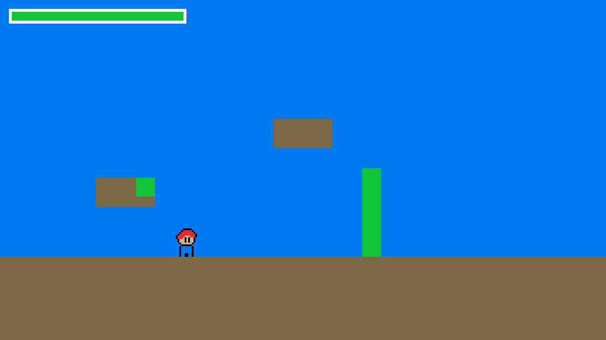

# leaf-project

## Description:
Raylib NEXT Gamejam
Theme:connections

Theme game explanation: we've brained far away to think connections with mother nature, we are connected and need to use nature to complete levels.

It's a platformer with puzzling mind.

## Features:
Game introduce into connected nature, we can modify fastly the nature to finish the levels.
- Grow plants with your mana.
- Move, jump and climb

## Controls:
Keyboard only.
- WASD or ZQSD (depend on your keyboard)
- Space to jump
- Enter to interact with mother nature

## Developers:
    - BH3Panzer (repo owner), dev, music
    - Fraï , dev, graphics
